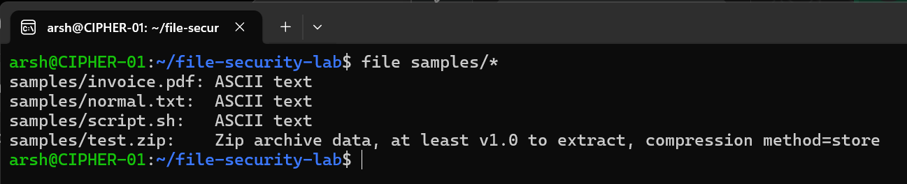
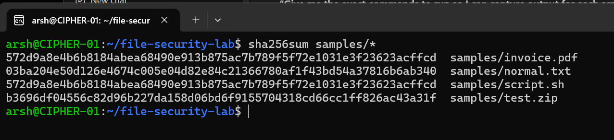
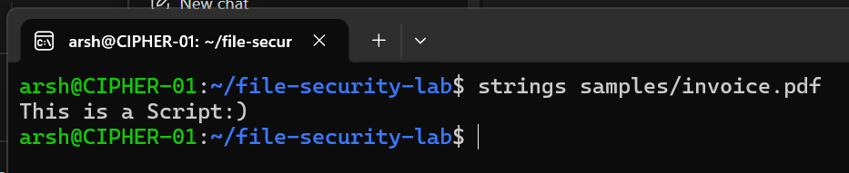
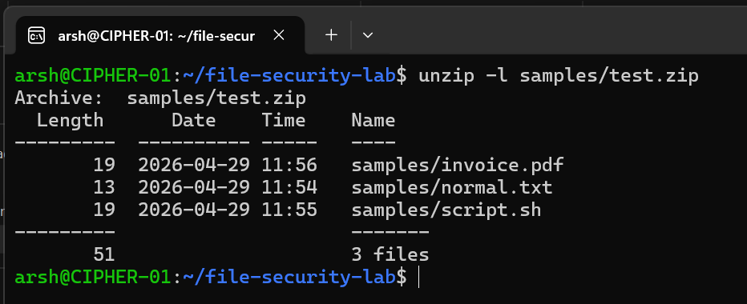
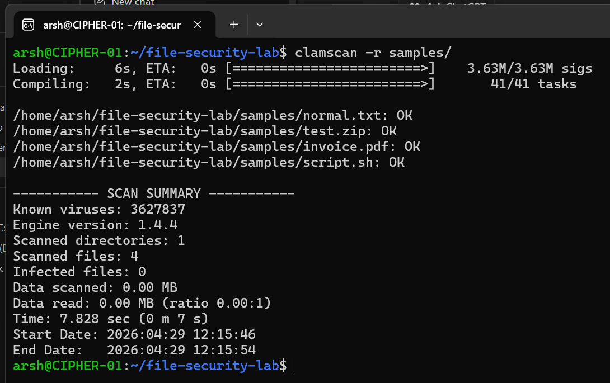

# 🛡️ Linux File Security & Malware Analysis Lab

## 📌 Description

This project demonstrates a **basic file security and malware analysis workflow** performed in a controlled Linux environment.
It focuses on identifying disguised files, analyzing file contents, generating hashes, and scanning files for malware using command-line tools.

---

## 🎯 Objective

* Detect disguised or suspicious files
* Perform static file analysis
* Generate file hashes for identification
* Scan files using antivirus tools
* Safely inspect compressed files

---

## ⚙️ Tools & Technologies

* Linux (WSL / Ubuntu)
* ClamAV (antivirus scanner)
* file, strings, sha256sum, hexdump
* zip / unzip

---

## 🧠 Lab Workflow

### 🔹 Step 1: File Type Verification

Verified actual file types to detect disguised files.

```bash id="g2s7a1"
file samples/*
```

📸 

---

### 🔹 Step 2: Hash Generation

Generated SHA-256 hashes for file identification and integrity verification.

```bash id="6q3hcz"
sha256sum samples/*
```

📸 

---

### 🔹 Step 3: Static Analysis (Strings)

Extracted readable content from files to inspect hidden data.

```bash id="6b3glt"
strings samples/invoice.pdf
```

📸 

---

### 🔹 Step 4: Archive Inspection

Inspected compressed files without extracting to avoid execution risks.

```bash id="3qkqk9"
unzip -l samples/test.zip
```

📸 

---

### 🔹 Step 5: Malware Scanning

Scanned files recursively using ClamAV.

```bash id="0o8r6g"
clamscan -r samples/
```

📸 

---

## 🔍 Observations

* Detected mismatch between file extension and actual file type
* Identified readable content inside disguised files
* Verified file integrity using hash values
* Successfully scanned files for known malware signatures

---

## ⚠️ Risks Identified

* File extensions can be misleading
* Hidden scripts may exist inside harmless-looking files
* Unverified files can pose security threats

---

## 🛡️ Recommendations

* Always verify file type before execution
* Use antivirus tools to scan unknown files
* Avoid extracting files from untrusted sources
* Use sandbox or isolated environment for analysis

---

## ⚡ Features

* File type verification using system utilities
* Static analysis using strings and hex inspection
* File integrity verification via hashing
* Malware scanning using ClamAV
* Safe archive inspection

---

## 🧪 Example Output

```text id="f3z3hf"
samples/invoice.pdf: ASCII text
e3b0c44298fc1c149afbf4c8996fb924...  samples/invoice.pdf

----------- SCAN SUMMARY -----------
Known viruses: XXXXXXX
Scanned directories: 1
Scanned files: X
Infected files: 0
```

---

## ⚠️ Limitations

* Signature-based detection only (ClamAV)
* No dynamic malware analysis
* Limited to basic static inspection

---

## 🚀 Future Improvements

* Integrate VirusTotal API for hash lookup
* Add automated report generation
* Implement sandbox-based dynamic analysis
* Add file metadata extraction

---

## 🛡️ Security Insight

This lab demonstrates how attackers disguise malicious files and how defenders can detect them using simple yet effective analysis techniques.

---

## ⚠️ Disclaimer

All analysis was performed in a **controlled environment** for educational purposes only.
No real malware was executed.

---

